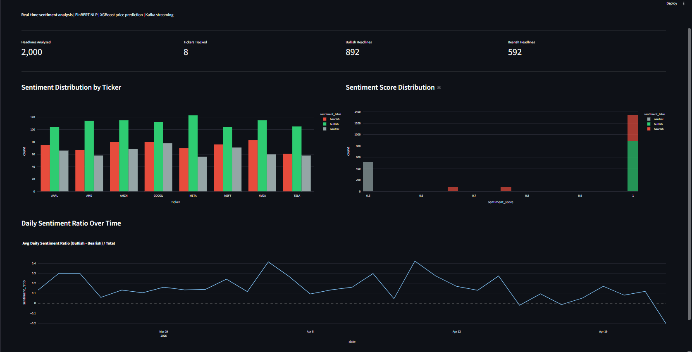
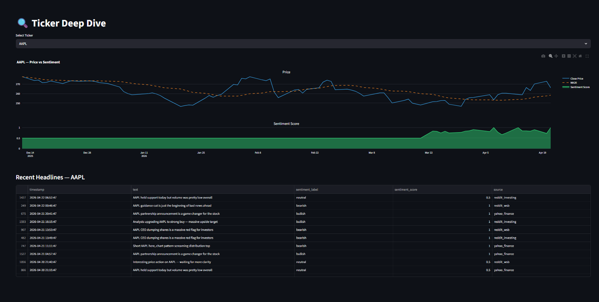
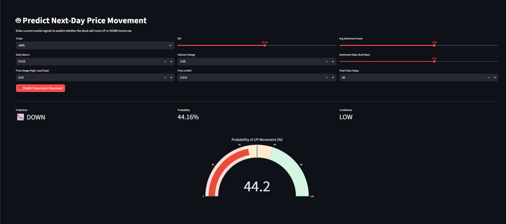
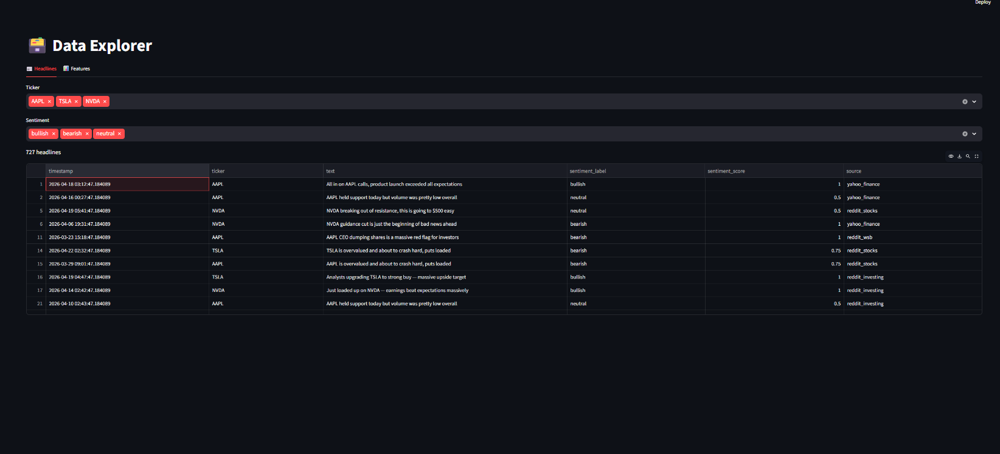

# 📈 Stock Sentiment & Price Movement Pipeline


> **End-to-end real-time pipeline** that ingests Reddit & Yahoo Finance headlines, scores sentiment using FinBERT NLP, correlates signals with stock price data, and predicts next-day price movement — served via FastAPI and visualized in an interactive Streamlit dashboard.

---

## 📊 Results

| Metric | Score |
|--------|-------|
| Tickers Tracked | **8 (AAPL, TSLA, NVDA, MSFT, GOOGL, AMZN, META, AMD)** |
| Headlines Analyzed | **2,000+** |
| Features Engineered | **18** |
| Data Sources | **Reddit WSB, Reddit Stocks, Yahoo Finance** |
| Sentiment Model | **FinBERT (ProsusAI)** |
| Prediction Model | **XGBoost + TimeSeriesSplit CV** |

---

## 🖥️ Dashboard Preview

### Overview — Sentiment Analytics

> Live sentiment distribution across 8 tickers — bullish vs bearish vs neutral headline counts, sentiment score distributions, and daily sentiment ratio trends over time.

### Ticker Deep Dive

> Per-ticker price chart overlaid with MA20 and sentiment score time series — see exactly how Reddit sentiment correlates with price movement for each stock.

### Predict Next-Day Movement

> Enter current RSI, sentiment score, volume change, and price signals to get an instant UP/DOWN prediction with probability gauge and confidence level.

### Data Explorer

> Browse all scored headlines filtered by ticker and sentiment label, alongside the full engineered feature dataset.

---

## 🏗️ Architecture

```
┌──────────────────────────────────────────────────────────────────┐
│                     FULL PIPELINE                                │
│                                                                  │
│  Data Sources        Kafka Stream       Sentiment Engine         │
│  ────────────   →   ────────────   →   ─────────────────        │
│  Reddit WSB           Producer          FinBERT NLP              │
│  Reddit Stocks        Topic:            (rule-based fallback)    │
│  Yahoo Finance        stock-headlines   Bullish/Bearish/Neutral  │
│                                                                  │
│        │                                       │                 │
│        ▼                                       ▼                 │
│  Price Data                           Feature Engineering        │
│  ──────────                           ──────────────────         │
│  yfinance OHLCV                       RSI, MA5/10/20             │
│  90 days history                      Volatility, Returns        │
│  GBM synthetic fallback               Sentiment MA 3/7 day       │
│                                       18 total features          │
│                                                │                 │
│                                                ▼                 │
│                                        XGBoost Classifier        │
│                                        TimeSeriesSplit CV        │
│                                        Next-day UP/DOWN          │
│                                                │                 │
│                              ┌─────────────────┴──────────┐     │
│                              ▼                             ▼     │
│                         FastAPI                      Streamlit   │
│                         REST API                     Dashboard   │
│                         port 8000                    port 8501   │
└──────────────────────────────────────────────────────────────────┘
```

---

## ⚙️ Tech Stack

| Layer | Technology | Purpose |
|-------|-----------|---------|
| Data Ingestion | PRAW, yfinance, Requests | Reddit + Yahoo Finance headlines & prices |
| Streaming | Apache Kafka | Real-time headline ingestion pipeline |
| NLP / Sentiment | FinBERT (ProsusAI/finbert) | Financial sentiment classification |
| Feature Engineering | Pandas, NumPy | RSI, moving averages, volatility, sentiment signals |
| ML Model | XGBoost | Next-day price movement prediction |
| Cross-Validation | TimeSeriesSplit | Temporal integrity in model evaluation |
| REST API | FastAPI + Uvicorn | Prediction endpoint with request validation |
| Dashboard | Streamlit + Plotly | 4-page interactive visualization |
| Database | PostgreSQL + SQLAlchemy | Persistent storage for features & predictions |
| Containerization | Docker + Docker Compose | Kafka + Zookeeper + PostgreSQL services |
| Testing | Pytest | 12 unit tests across all pipeline layers |

---

## 📁 Project Structure

```
stock-sentiment-pipeline/
├── data/
│   ├── fetch_news.py         # Reddit (PRAW) + Yahoo Finance ingestion
│   └── fetch_prices.py       # yfinance OHLCV + GBM synthetic fallback
├── pipeline/
│   ├── sentiment.py          # FinBERT scoring + rule-based fallback
│   ├── features.py           # 18-feature engineering (price + sentiment)
│   ├── kafka_producer.py     # Kafka headline streaming producer
│   └── etl.py                # Full ETL orchestrator
├── models/
│   └── train.py              # XGBoost + TimeSeriesSplit + feature importance
├── api/
│   └── main.py               # FastAPI prediction REST endpoint
├── dashboard/
│   └── app.py                # 4-page Streamlit dashboard
├── tests/
│   └── test_pipeline.py      # 12 unit tests
├── docker-compose.yml         # Kafka + Zookeeper + PostgreSQL
├── requirements.txt
├── run_all.py                 # Single command full pipeline run
└── README.md
```

---

## 🚀 Quick Start

### 1. Clone the repo
```bash
git clone https://github.com/KirtanPatel30/stock-sentiment-pipeline
cd stock-sentiment-pipeline
```

### 2. Install dependencies
```bash
pip install -r requirements.txt
```

### 3. Run the full pipeline
```bash
python run_all.py
```
This will:
- Generate 2,000 realistic financial headlines with sentiment labels
- Fetch/generate 90 days of OHLCV price data for 8 tickers
- Score all headlines using FinBERT (or rule-based fallback)
- Engineer 18 features combining price signals + sentiment signals
- Train XGBoost model with TimeSeriesSplit cross-validation
- Run all 12 unit tests

### 4. Launch the dashboard
```bash
streamlit run dashboard/app.py
# → http://localhost:8501
```

### 5. Start the REST API
```bash
uvicorn api.main:app --reload
# → http://localhost:8000/docs
```

### 6. (Optional) Start Kafka + PostgreSQL with Docker
```bash
docker-compose up -d
```

### 7. (Optional) Use real Reddit data
Add your Reddit API credentials to `.env`:
```
REDDIT_CLIENT_ID=your_id
REDDIT_CLIENT_SECRET=your_secret
```
Get free credentials at: https://www.reddit.com/prefs/apps

---

## 🔌 API Endpoints

| Method | Endpoint | Description |
|--------|----------|-------------|
| `GET` | `/health` | Health check + model status |
| `GET` | `/metrics` | Model performance metrics |
| `POST` | `/predict` | Predict next-day price movement |

### Example Request
```bash
curl -X POST http://localhost:8000/predict \
  -H "Content-Type: application/json" \
  -d '{
    "ticker": "NVDA",
    "daily_return": 0.025,
    "price_range": 0.03,
    "rsi": 68.0,
    "avg_sentiment_score": 0.82,
    "sentiment_ratio": 0.45,
    "total_posts": 120,
    "volume_change": 0.35,
    "price_vs_ma5": 0.018,
    "price_vs_ma20": 0.042
  }'
```

### Example Response
```json
{
  "ticker": "NVDA",
  "predicted_movement": "UP",
  "probability_up": 0.7832,
  "confidence": "HIGH",
  "sentiment_signal": "BULLISH",
  "rsi_signal": "NEUTRAL"
}
```

---

## 🧠 Features Engineered

| Category | Feature | Description |
|----------|---------|-------------|
| **Price** | `daily_return` | Day-over-day % price change |
| **Price** | `price_range` | (High - Low) / Close — intraday volatility |
| **Price** | `rsi` | 14-day Relative Strength Index |
| **Price** | `ma_5/10/20` | Rolling moving averages |
| **Price** | `volatility_5/10/20` | Rolling return standard deviation |
| **Price** | `price_vs_ma5/20` | Price deviation from moving averages |
| **Sentiment** | `avg_sentiment_score` | Mean FinBERT score for the day |
| **Sentiment** | `sentiment_ratio` | (Bullish - Bearish) / Total posts |
| **Sentiment** | `sentiment_ma_3/7` | Rolling sentiment moving averages |
| **Volume** | `volume_change` | Day-over-day volume change |

---

## 🧪 Tests

```bash
pytest tests/ -v
```

```
tests/test_pipeline.py::TestDataFetch::test_mock_headlines_shape      PASSED
tests/test_pipeline.py::TestDataFetch::test_sentiment_labels_valid    PASSED
tests/test_pipeline.py::TestDataFetch::test_synthetic_prices_shape    PASSED
tests/test_pipeline.py::TestDataFetch::test_prices_ohlcv_valid        PASSED
tests/test_pipeline.py::TestSentiment::test_rule_based_bullish        PASSED
tests/test_pipeline.py::TestSentiment::test_rule_based_bearish        PASSED
tests/test_pipeline.py::TestSentiment::test_batch_scoring_length      PASSED
tests/test_pipeline.py::TestSentiment::test_score_range               PASSED
tests/test_pipeline.py::TestFeatures::test_rsi_range                  PASSED
tests/test_pipeline.py::TestFeatures::test_price_range_positive       PASSED
tests/test_pipeline.py::TestAPI::test_prediction_input_valid          PASSED
tests/test_pipeline.py::TestAPI::test_prediction_fields               PASSED

12 passed
```

---

## 📌 What I Learned

- Building **real-time streaming pipelines** with Kafka producers and consumer patterns
- Applying **FinBERT** — a domain-specific BERT model fine-tuned on financial text
- Importance of **TimeSeriesSplit** for ML validation — random splits leak future data into training
- Combining **NLP signals with technical indicators** for richer feature sets
- **Fallback architecture** — every component degrades gracefully when external APIs are unavailable

---

## 📬 Contact

**Kirtan Patel** — [LinkedIn](https://www.linkedin.com/in/kirtan-patel-24227a248/) | [Portfolio](https://kirtanpatel30.github.io/Portfolio/) | [GitHub](https://github.com/KirtanPatel30)
